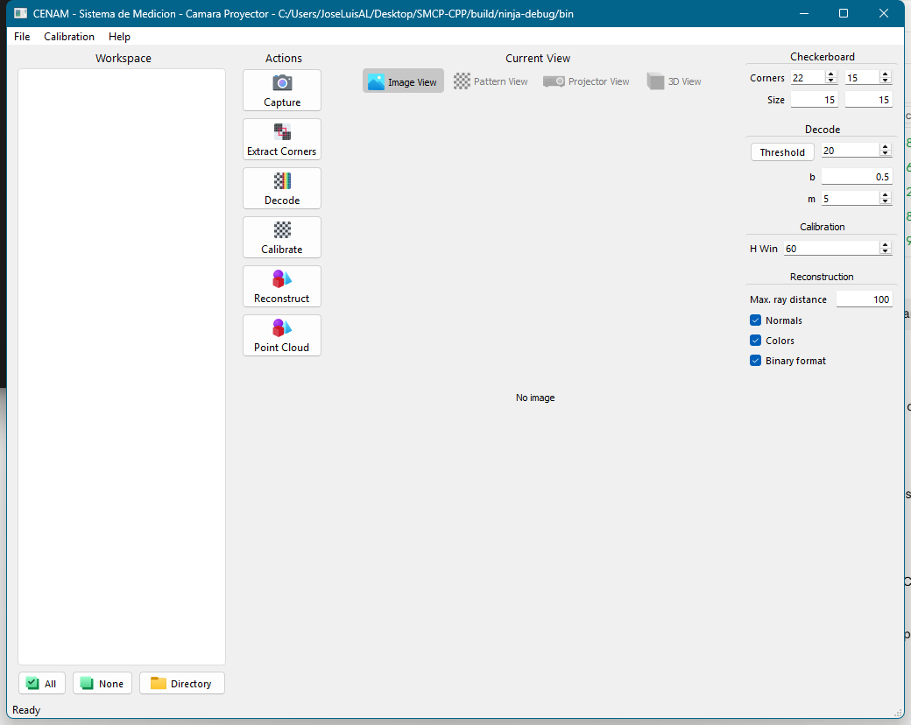
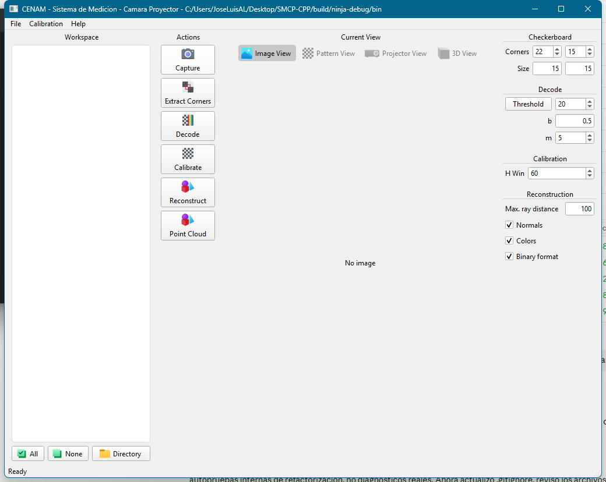
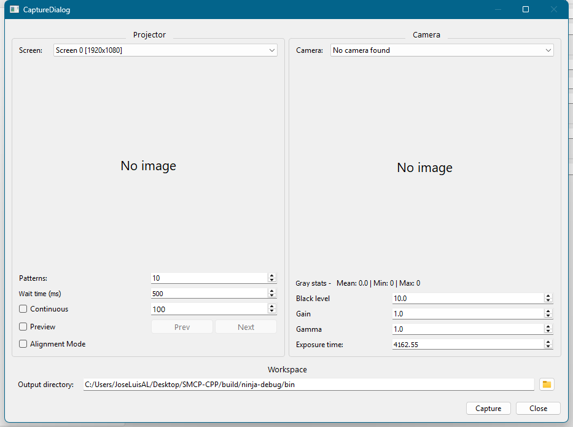
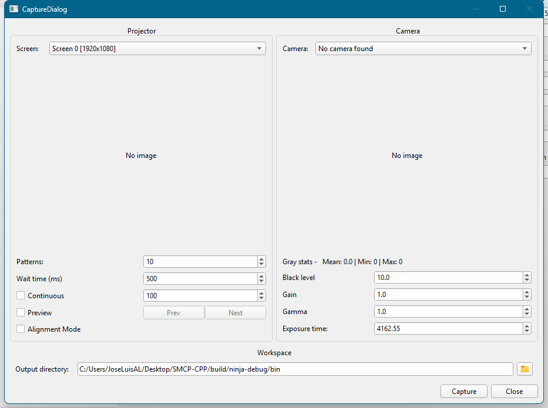
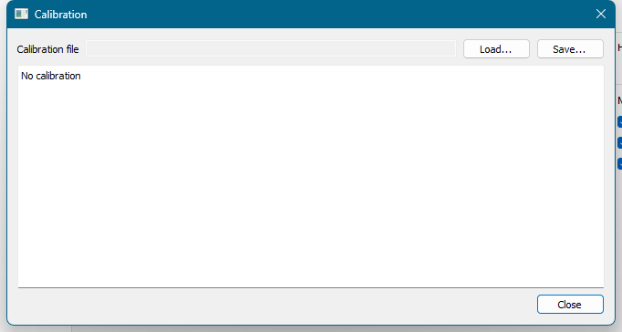
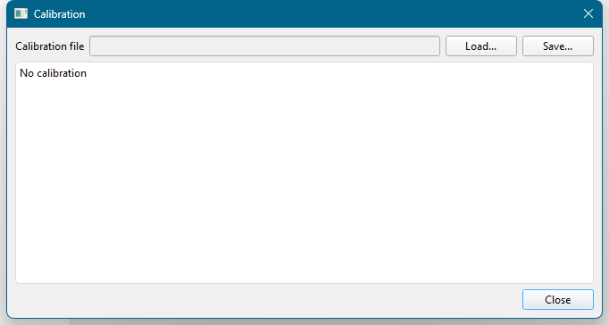
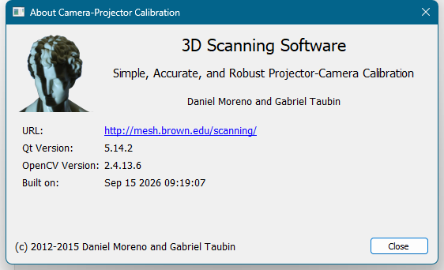
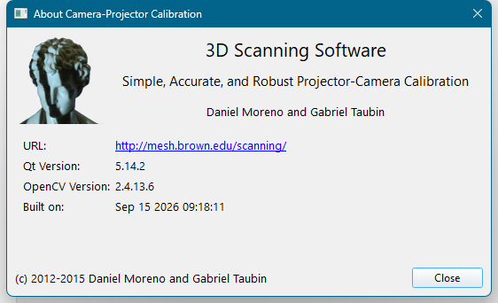

# Tema visual

SMCP tiene **un solo tema**, definido en [`resources/theme/smcp.qss`](../resources/theme/smcp.qss)
y aplicado una única vez en `smcp::Application::apply_theme()`
([`src/app/Application.cpp`](../src/app/Application.cpp)):

1. `setStyle(QStyleFactory::create("Fusion"))` — estilo base neutro, igual en todas las
   versiones de Windows.
2. `setFont(QFont("Segoe UI", 9))` — fuente de aplicación; todos los widgets la heredan.
3. `setStyleSheet(...)` con el contenido de `:/theme/smcp.qss` (embebido vía
   `resources/resources.qrc`).

Ningún archivo `.ui` define propiedades `styleSheet` ni `font`, y ningún widget llama a
`setStyleSheet`/`setFont` en código. La única excepción es `ProjectorWidget`, que pinta
la cruz de alineación con el color de acento (`#3e8948`) directamente con `QPainter`: no es
un widget estilizable por QSS porque dibuja sobre el patrón proyectado a pantalla completa.

## Tokens

QSS no admite variables, así que los tokens se documentan en la cabecera del archivo y sus
valores se repiten literalmente en las reglas. Si cambias un token, búscalo y sustitúyelo
en toda la hoja.

| Token | Valor | Uso |
|---|---|---|
| `base` | `#f0f0f0` | Fondo de ventanas, diálogos y grupos |
| `surface` | `#ffffff` | Fondo de vistas (árbol, texto) y barra de progreso |
| `border` | `#d1d1d1` | Borde y separador de `QGroupBox` |
| `border-soft` | `#dcdcdc` | Borde de vistas, campos y progreso |
| `hover` | `rgba(199,199,199,0.4)` | Fondo al pasar el ratón por los botones de vista |
| `active` | `#c7c7c7` | Botón de vista pulsado o seleccionado |
| `accent` | `#3e8948` | Relleno de `QProgressBar` y cruz de alineación |
| Fuente base | Segoe UI 9 pt | Todo (vía `QApplication::setFont`) |
| Título de grupo | 10 pt, negrita | `QGroupBox::title` |
| Etiquetas "Acerca de" | 10 pt | `QDialog#AboutDialog QLabel` |
| Subtítulo | 11 pt | `#course_label` del diálogo "Acerca de" |
| Título | 16 pt | `#title_label` del diálogo "Acerca de" |
| Radio | 4 px | Grupos, vistas, campos y botones de vista |
| Margen de diálogo | 9 px, spacing 6 px | Layout raíz de cada `QDialog` (en el `.ui`) |
| Margen de grupo | 6 px, spacing 6 px | Layouts internos de `MainWindow.ui` |

## Organización de la hoja

Las reglas van de lo general a lo particular:

1. **Superficies base**: `QMainWindow`, `QDialog`, `QGroupBox`.
2. **Grupos**: geometría del `QGroupBox` y de su `::title`. Dos variantes por `objectName`
   porque el diseño original las distingue: los grupos de parámetros del panel derecho
   (`#checkerboard_group`, `#robust_decode_group`, `#calibration_group`,
   `#reconstruction_group`) llevan solo separador superior; los de proyector y cámara
   (`#projector_group`, `#camera_group`) llevan borde completo.
3. **Vistas y campos**: `QTreeView`, `QListView`, `QTableView`, `QTextEdit`,
   `QPlainTextEdit`.
4. **Selector de vista**: los `QToolButton` dentro de `#current_image_group` son planos y
   muestran estado `checked`. Está acotado al grupo para que los botones de acciones
   (`Capture`, `Decode`, …), que también son `QToolButton`, conserven el aspecto normal.
5. **Editor de nubes de puntos** (`QDialog#PointcloudEditorDialog`): barra de comandos con
   `QToolButton` planos (texto junto al icono, `padding: 6px`) y la lista superpuesta del
   visor 3D (`#pointcloud_overlay_list`, `#pointcloud_overlay_label`,
   `#pointcloud_overlay_delete`), que es la única superficie oscura del tema
   (`rgba(20,20,20,180)` sobre el fondo negro del visor) porque flota sobre la nube.
6. **Progreso**: `QProgressBar` y su `::chunk` con el acento.
7. **Diálogo "Acerca de"**: tamaños de fuente de sus etiquetas.

Regla general: **selecciona por tipo de widget**; usa `objectName` solo cuando un widget
concreto debe diferir del resto (como los casos anteriores).

## Cómo añadir un widget nuevo sin romper el tema

- Crea el `.ui` sin tocar `styleSheet` ni `font` en ningún widget. Qt Designer permite
  editarlas, pero cualquier valor ahí *gana* al tema global y reintroduce inconsistencias.
- Usa los tipos estándar (`QGroupBox`, `QLineEdit`, `QToolButton`, …): ya están cubiertos.
  Si el widget hereda de uno estándar, hereda también sus reglas.
- Layout raíz de un diálogo: margen 9 y spacing 6; layouts dentro de un grupo: 6 y 6.
  Fíjalos explícitamente en el `.ui` para no depender de los valores por defecto del estilo.
- Si el widget necesita un color, usa uno de los tokens y añade la regla al bloque que le
  corresponda en `smcp.qss`, preferiblemente por tipo (`QMiWidget { ... }`). Reserva
  `#objectName` para excepciones puntuales y documenta el porqué en un comentario.
- Si el widget pinta con `QPainter` (como `ProjectorWidget` o `PixmapWidget`), toma los
  colores de la tabla de tokens y deja constancia en este documento.
- Para comprobar el resultado, compila y abre cada diálogo: `MainWindow`, `Capture`,
  `Calibration`, `About` y `Processing` deben compartir fondo, tipografía y bordes.

## Antes y después

Capturas de `build/ninja-debug/bin/SMCP_d.exe` en Windows 11 (tema claro), antes
(estilos incrustados en los `.ui`, estilo nativo de Windows) y después (Fusion +
`smcp.qss`). El cambio es visualmente neutro salvo por las inconsistencias corregidas:
tamaños de fuente unificados (antes convivían 9 pt, 10 pt, `10px` y valores heredados),
controles nativos de Windows sustituidos por Fusion y márgenes de diálogo homogéneos.

| | Antes | Después |
|---|---|---|
| Ventana principal |  |  |
| Captura |  |  |
| Calibración |  |  |
| Acerca de |  |  |
