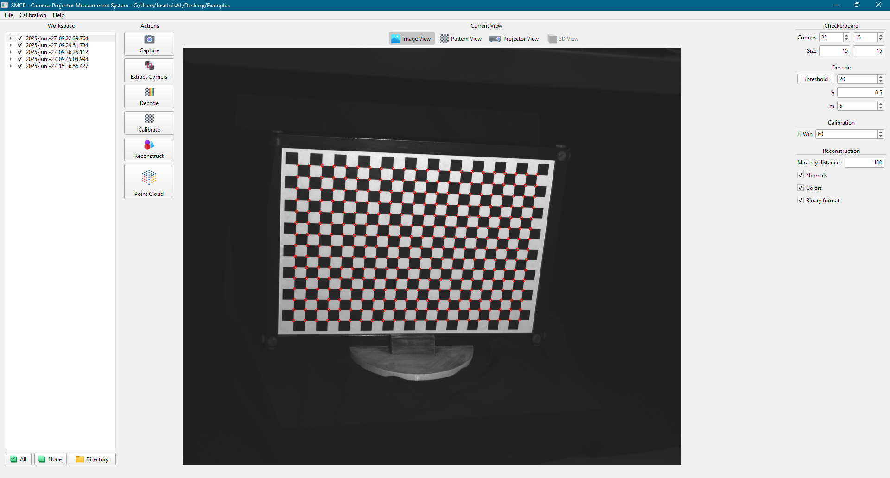
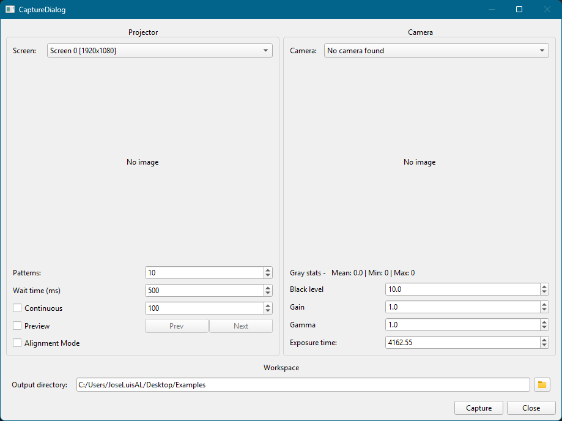
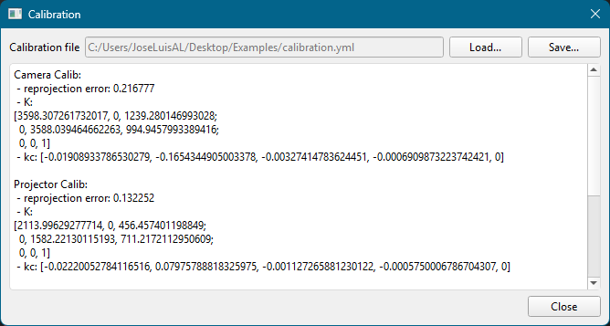
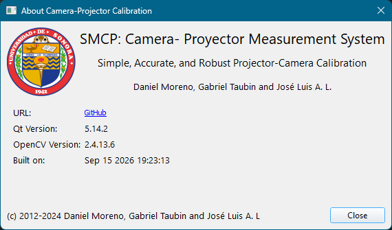
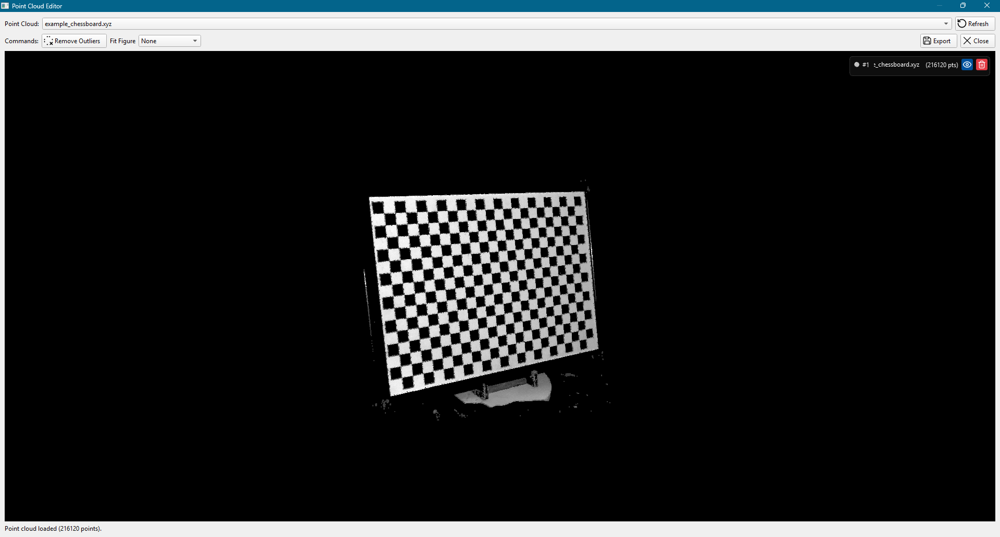
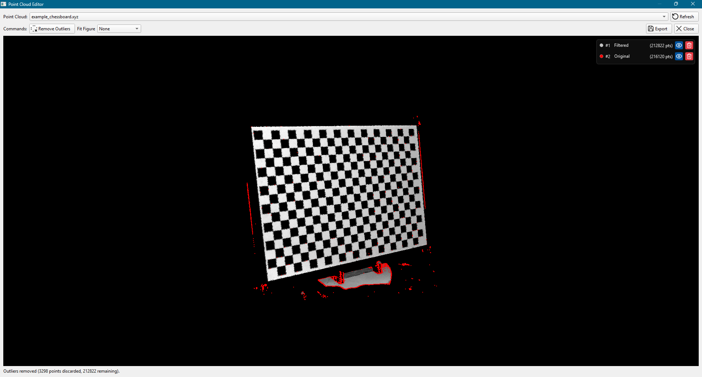
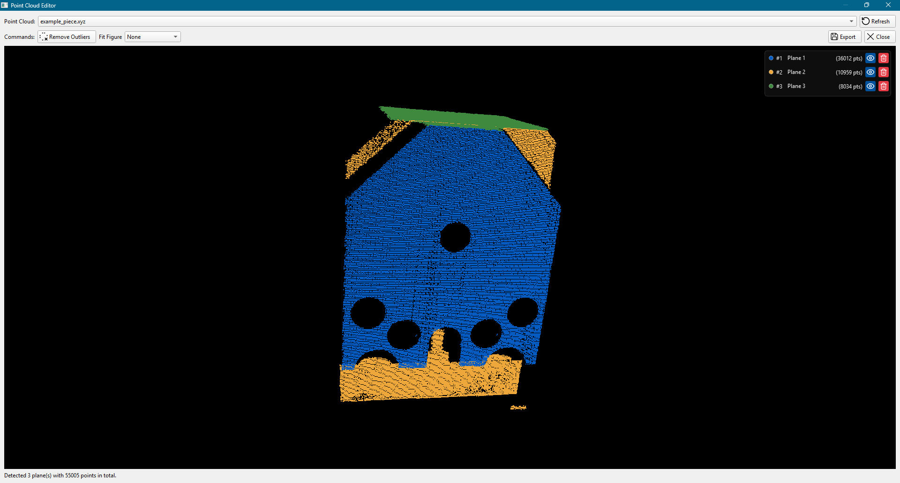
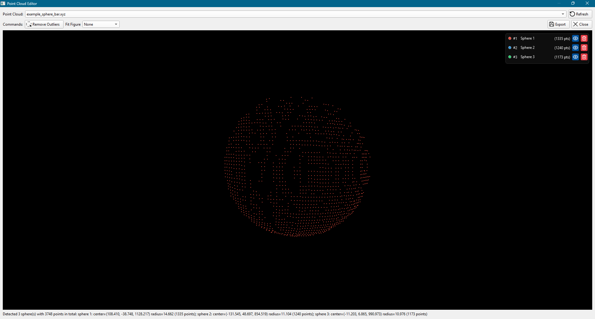

# Visual style

SMCP uses one application-wide theme from
[`resources/theme/smcp.qss`](../resources/theme/smcp.qss). `Application::ApplyTheme()`
applies it in three steps:

1. select Qt's Fusion style for consistent controls across supported Windows versions;
2. set Segoe UI 9 pt as the inherited application font; and
3. load the embedded `:/theme/smcp.qss` stylesheet from `resources/resources.qrc`.

Widget-specific styles should be exceptional. Keeping shared appearance in the QSS file
makes new dialogs match the rest of the program without duplicating declarations in Qt
Designer.

## Design tokens

QSS has no variables, so the token values are documented here and repeated literally in
the stylesheet. Search the complete QSS file before changing one.

| Token | Value | Purpose |
|---|---|---|
| `base` | `#f0f0f0` | Main-window, dialog, and group backgrounds |
| `surface` | `#ffffff` | Views, editors, and progress-bar background |
| `border` | `#d1d1d1` | Group borders and separators |
| `border-soft` | `#dcdcdc` | View, field, and progress borders |
| `hover` | `rgba(199, 199, 199, 0.4)` | Hovered view selector |
| `active` | `#c7c7c7` | Checked or pressed view selector |
| `accent` | `#3e8948` | Progress and projector-alignment accent |
| `overlay` | `rgba(20, 20, 20, 180)` | Point-cloud list over the black 3D viewport |
| `visibility` | `#00529d` | Point-cloud visibility button |
| `delete` | `#e43b44` | Point-cloud delete button |

Typography and geometry conventions:

| Element | Convention |
|---|---|
| Application text | Segoe UI 9 pt |
| Group title | 10 pt, bold |
| About-dialog labels | 10 pt |
| About subtitle | 11 pt |
| About title | 16 pt |
| Standard corner radius | 4 px |
| Dialog root layout | 9 px margins, 6 px spacing |
| Main-window group content | 6 px margins, 6 px spacing |

## Stylesheet organization

Rules in `smcp.qss` move from broad to specific:

1. base surfaces (`QMainWindow`, `QDialog`, `QGroupBox`);
2. group-box geometry and titles;
3. item views and text fields;
4. the Current View tool buttons and their checked state;
5. point-cloud editor controls and preview overlay;
6. progress bar; and
7. About-dialog typography.

Prefer selectors by widget type. Use an `objectName` selector only when one concrete widget
must differ from other widgets of the same type. For example, the right-side parameter
groups use a top separator while camera and projector groups use a complete border.

The Current View button rules are scoped to `#current_image_group`. This prevents Capture,
Decode, and other `QToolButton` actions from inheriting the flat selector appearance.

## Point-cloud overlay

`PointcloudPreviewWidget` places a compact list on top of its black OpenGL viewport. Each
row contains:

- a circular color swatch matching the cloud's rendered color;
- a name, editable by double-clicking it;
- the current point count;
- a blue visibility button with a white open-eye or closed-eye icon; and
- a red delete button with a white trash icon.

The overlay surface and buttons are defined in QSS. The color swatch is a deliberate
runtime `setStyleSheet()` exception because its value belongs to each cloud, not to the
application theme. `ProjectorWidget` is the other color exception: it paints the alignment
cross with `QPainter` because the mark is part of the projected image.

## Adding UI without breaking consistency

- Create form-based dialogs as `.ui` files and keep the form next to its C++ class.
- Do not set `font` or `styleSheet` properties in Designer for ordinary controls; local
  properties override the global theme.
- Use standard Qt widgets whenever possible so existing rules apply automatically.
- Use 9 px margins and 6 px spacing on a dialog's root layout. Use 6 px for nested control
  groups.
- Put reusable previews in `src/ui/preview`, item models in `src/ui/models`, and widgets
  without their own form in `src/ui/widgets`.
- If a new control needs a semantic color, reuse a token or add and document one here and in
  the QSS header.
- Add SVGs and other embedded assets to `resources/resources.qrc`. Prefer `currentColor` or
  a white fill/stroke for icons displayed on dark or saturated button backgrounds.
- Verify normal, hover, pressed, checked, disabled, and keyboard-focus states.

## Current visual reference

These screenshots were captured from the current Release build. They are visual references,
not pixel-perfect automated snapshots.

| Window | Reference |
|---|---|
| Main window |  |
| Capture |  |
| Calibration |  |
| About |  |

The point-cloud editor screenshots demonstrate its operations:

| State | Reference |
|---|---|
| Loaded cloud |  |
| Outlier comparison |  |
| Plane fitting |  |
| Sphere fitting |  |
